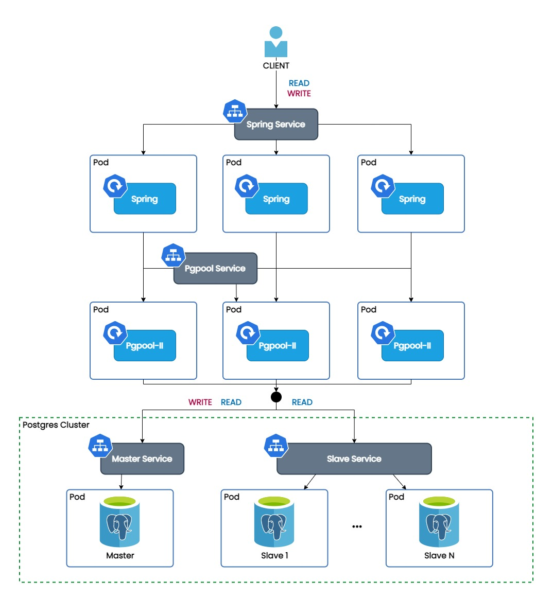

# Postgres Kubernetes cluster with Pgpool-II Load Balancer

This repository provides `YAML` files to deploy a Postgres cluster on Kubernetes. The cluster is managed by the
CrunchyData Postgres Operator (PGO) v5. PGO ensures replication and automatic failover. Pgpool-II provides connection
pooling and query load balancing. Any write queries are directed to the master database instance while read queries are
load balanced across all instances.

## Prerequisites

Before running the Postgres cluster, the following dependencies are required:
- A Kubernetes cluster with `kubectl` installed.

For this project, a cluster was initialized with minikube. Minikube can be started as follows:

```shell
minikube start
```

## Architecture


## Installation

While the Kubernetes cluster is up, the Postgres cluster can simply be installed by running the following command:
```shell
./install.sh
```

This installs the CrunchyData Postgres Operator, creates a Postgres cluster, and sets up a Pgpool-II service to which you can connect. The command `kubectl -n postgres-operator get all` should return something like:
```
NAME                         READY   STATUS    RESTARTS   AGE
pod/hippo-instance1-87ps-0   3/3     Running   0          18s
pod/hippo-instance1-jcvc-0   3/3     Running   0          19s
pod/hippo-instance1-qpqb-0   3/3     Running   0          18s
pod/hippo-repo-host-0        1/1     Running   0          18s
pod/pgo-85684987c9-jsplx     1/1     Running   0          22s
pod/pgpool-f57c596b-dvfqg    1/1     Running   0          21s

NAME                      TYPE        CLUSTER-IP      EXTERNAL-IP   PORT(S)    AGE
service/hippo-ha          ClusterIP   10.111.150.71   <none>        5432/TCP   19s
service/hippo-ha-config   ClusterIP   None            <none>        <none>     19s
service/hippo-pods        ClusterIP   None            <none>        <none>     19s
service/hippo-primary     ClusterIP   None            <none>        5432/TCP   19s
service/hippo-replicas    ClusterIP   10.99.167.165   <none>        5432/TCP   19s
service/pgpool-svc        ClusterIP   10.110.229.79   <none>        9999/TCP   21s

NAME                     READY   UP-TO-DATE   AVAILABLE   AGE
deployment.apps/pgo      1/1     1            1           22s
deployment.apps/pgpool   1/1     1            1           21s

NAME                              DESIRED   CURRENT   READY   AGE
replicaset.apps/pgo-85684987c9    1         1         1       22s
replicaset.apps/pgpool-f57c596b   1         1         1       21s

NAME                                    READY   AGE
statefulset.apps/hippo-instance1-87ps   1/1     18s
statefulset.apps/hippo-instance1-jcvc   1/1     19s
statefulset.apps/hippo-instance1-qpqb   1/1     18s
statefulset.apps/hippo-repo-host        1/1     18s
```

## Connecting from outside the Kubernetes cluster

To connect to the Kubernetes cluster from outside, we need to expose the Pgpool-II service. This can be done with either one of the following two commands:

```shell
# when a local cluster is running on minikube
minikube service -n postgres-operator pgpool-svc --url
```

This shows a URL in the form of: 127.0.0.1:{port}. It is, for instance, possible to connect to the service through psql using the given port.

OR

```shell
PGPOOL_POD=$(kubectl -n postgres-operator get pod -o name -l app.kubernetes.io/name=pgpool)
kubectl -n postgres-operator port-forward "${PGPOOL_POD}" 30200:5432
```

In this case, the port that exposes the service is 30200. Psql can be used as follows to connect to the service:

```shell
psql -h localhost -p {port} -U hippo -d postgres
```